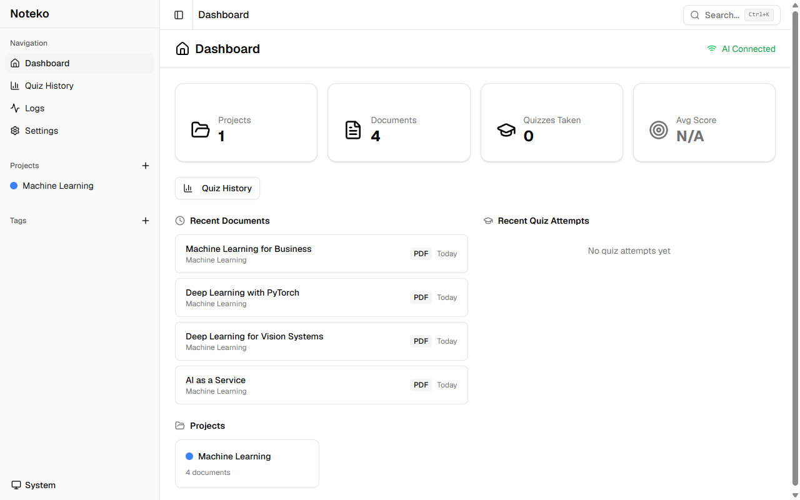
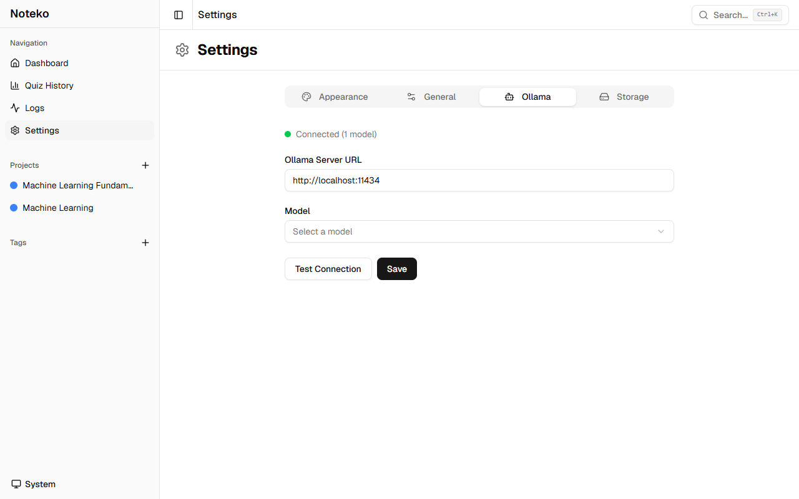
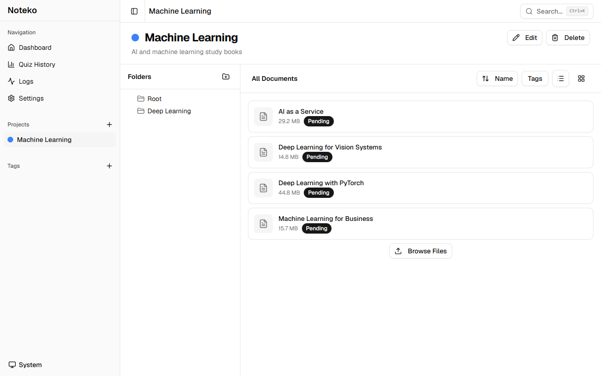
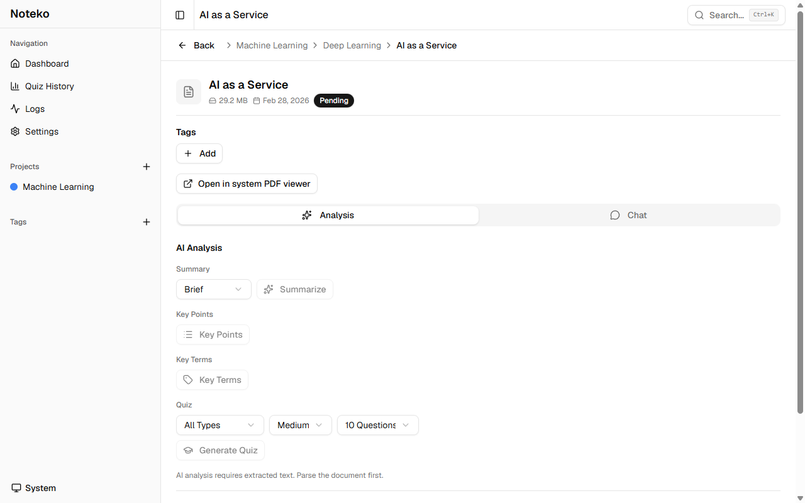
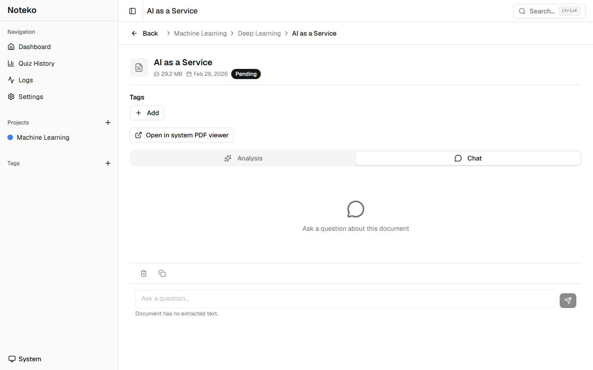
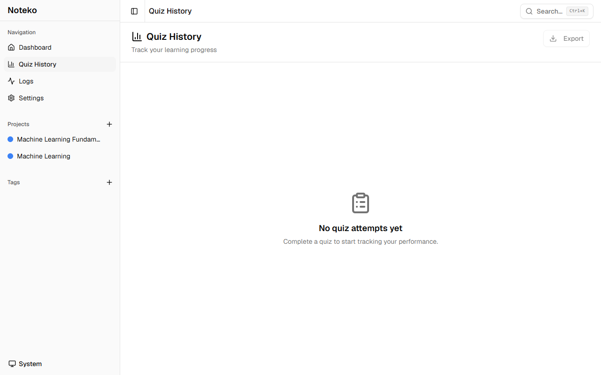
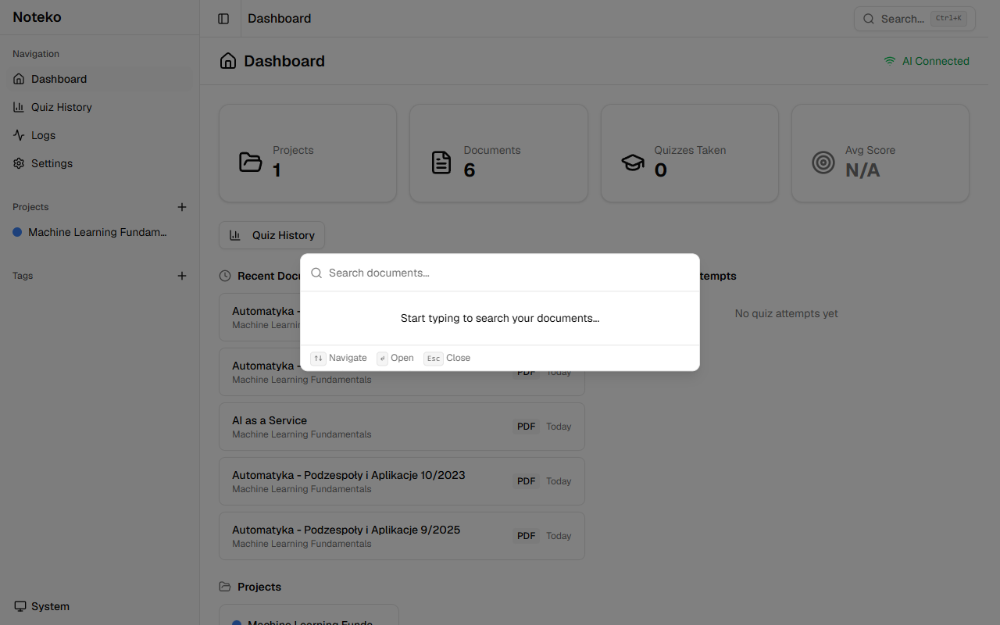
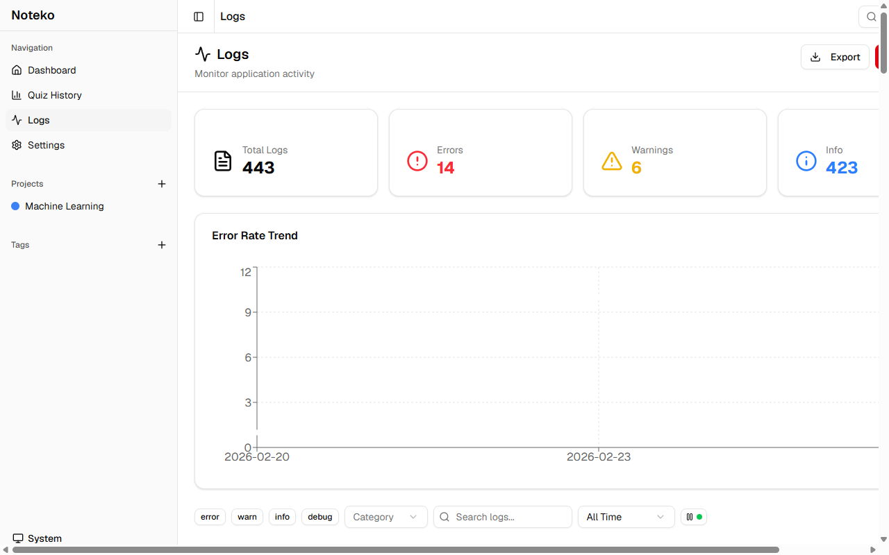

# Noteko User Guide

> **Noteko** is a privacy-first desktop app for studying with documents. Upload PDFs, images, and Word files — Noteko extracts key information, generates summaries, and creates interactive quizzes using a local AI model that never sends your data to the cloud.

## Table of Contents

- [Getting Started](#getting-started)
- [Setting Up Ollama (AI Engine)](#setting-up-ollama-ai-engine)
- [Organizing Your Work](#organizing-your-work)
  - [Projects](#projects)
  - [Folders](#folders)
  - [Tags](#tags)
- [Working with Documents](#working-with-documents)
  - [Uploading Documents](#uploading-documents)
  - [Viewing Documents](#viewing-documents)
  - [Processing Status](#processing-status)
- [AI Features](#ai-features)
  - [Summarization](#summarization)
  - [Key Points](#key-points)
  - [Key Terms](#key-terms)
  - [Chat with a Document](#chat-with-a-document)
- [Quizzes](#quizzes)
  - [Generating a Quiz](#generating-a-quiz)
  - [Taking a Quiz](#taking-a-quiz)
  - [Quiz History & Performance](#quiz-history--performance)
- [Search](#search)
- [Settings](#settings)
- [Logs & Analytics](#logs--analytics)
- [Troubleshooting](#troubleshooting)

---

## Getting Started

### First Launch

When you open Noteko for the first time, an **onboarding wizard** guides you through the initial setup in four steps:

1. **Welcome** — Overview of the app.
2. **Ollama Setup** — Connect to your local AI engine (see [Setting Up Ollama](#setting-up-ollama-ai-engine)).
3. **Create Your First Project** — Create a project to organize your documents.
4. **All Done** — A summary of what was configured.

You can skip any step and configure it later via **Settings**.

> To reopen the wizard at any time, go to **Settings → General** and click **Run Setup Wizard**.

### Dashboard



The dashboard shows an overview of your study activity: total projects, documents, quizzes taken, and average score. Recent documents and projects are listed for quick access.

---

## Setting Up Ollama (AI Engine)

Noteko uses [Ollama](https://ollama.ai) to run AI models locally. All processing happens on your machine — your documents are never sent to the internet.

### Step 1: Install Ollama

Download and install Ollama from [ollama.ai](https://ollama.ai). It is available for Windows, macOS, and Linux.

### Step 2: Pull a Model

Open a terminal and run:

```bash
ollama pull llama3.2
```

Other recommended models:

| Model     | Command                | Notes                                |
| --------- | ---------------------- | ------------------------------------ |
| Llama 3.2 | `ollama pull llama3.2` | Good balance of speed and quality    |
| Mistral   | `ollama pull mistral`  | Fast, accurate                       |
| Phi-3     | `ollama pull phi3`     | Lightweight, good for older hardware |

### Step 3: Configure Noteko

1. Open **Settings → Ollama**.
2. The **Ollama Server URL** defaults to `http://localhost:11434` — leave this as-is unless you're running Ollama on a different machine or port.
3. Click **Test Connection**. If connected, available models will appear in the **Model** dropdown.
4. Select your preferred model and click **Save**.



> **Note:** Ollama must be running in the background for AI features to work. On Windows and macOS, Ollama typically starts automatically after installation.

---

## Organizing Your Work

### Projects

Projects are the top-level containers for your study materials. Each project can contain folders and documents.

**Create a project:**

1. Click the **+** button next to "Projects" in the sidebar.
2. Enter a name, optional description, and choose a color.
3. Click **Create**.

**Edit a project:**

- Right-click a project in the sidebar and select **Edit**, or click the **⋯** menu.

**Delete a project:**

- Right-click a project and select **Delete**.
- Deleting a project permanently removes all its folders, documents, and associated data (summaries, quizzes, chat history).

> Projects are color-coded to help you distinguish them at a glance.



---

### Folders

Folders organize documents within a project. They can be nested to any depth.

**Create a folder:**

1. Select a project or parent folder in the sidebar.
2. Click the folder **+** icon, or right-click and select **New Folder**.
3. Enter a name and click **Create**.

**Rename or delete a folder:**

- Right-click a folder and select **Edit** or **Delete**.
- Deleting a folder removes all its documents, subfolders, and associated data.

---

### Tags

Tags are labels you can apply to documents for cross-project filtering.

**Create a tag:**

1. Open the **Tags** section in the sidebar.
2. Click **+** to create a new tag with a name and color.

**Apply tags to a document:**

- Open a document and use the **Tags** section in the metadata panel to add or remove tags.

**Filter by tag:**

- Click a tag in the sidebar to show only documents with that tag.

---

## Working with Documents

### Uploading Documents

Supported formats: **PDF**, **Images** (PNG, JPG, JPEG), **Word documents** (DOCX).

**To upload:**

1. Navigate to a project or folder in the sidebar.
2. Drag and drop files onto the document list, or click **Upload** to open a file picker.
3. Multiple files can be uploaded at once.

**Example:** Upload `Deep Learning with PyTorch.pdf`, `Machine Learning for Business.pdf`, or any DOCX lecture notes.

After upload, Noteko automatically:

1. Parses the document text (using PDF parsing, OCR for images, or DOCX conversion).
2. Stores the extracted text for AI analysis.

---

### Viewing Documents

Click any document in the list to open it.

**Images and text-based files** (PNG, JPG, DOCX, TXT, MD, CSV) open in a two-panel view:

- **Left panel** — In-app preview (image viewer or text preview).
- **Right panel** — Metadata, tags, AI analysis, and chat.

**PDF files** open in a single-panel view with full-width AI analysis. A button at the top lets you open the file in your system's default PDF viewer (e.g., Adobe Reader, Edge, Preview).

The right panel has two tabs:

- **Analysis** — AI-generated summaries, key points, key terms, and quiz generation.
- **Chat** — Ask questions about the document.



---

### Processing Status

Each document shows a processing status badge:

| Status         | Meaning                                       |
| -------------- | --------------------------------------------- |
| **Pending**    | Queued for text extraction                    |
| **Processing** | Text extraction in progress                   |
| **Ready**      | Text extracted, AI analysis available         |
| **Failed**     | Parsing failed — click **Retry** to try again |

> If a document fails to parse (e.g., a scanned PDF with poor quality), try uploading a higher-quality version or a different format.

---

## AI Features

AI features require Ollama to be running and a model selected in Settings. All features appear in the **Analysis** tab of the document view.

### Summarization

Generates a concise summary of the document.

1. Open a document with **Ready** status.
2. In the **Analysis** tab, select a summary style:
   - **Brief** — Short, high-level overview (2–3 sentences).
   - **Detailed** — Comprehensive summary with supporting points.
   - **Academic** — Formal tone suitable for academic review.
3. Click **Summarize**.

The summary streams in real-time as the model generates it. For long documents (e.g., a 200-page book like _AI as a Service_ or _Deep Learning for Vision Systems_), a progress indicator shows the percentage of sections processed.

---

### Key Points

Extracts the most important bullet points from the document.

- Click **Key Points** in the Analysis tab.
- Results are saved and displayed as a bulleted list.

---

### Key Terms

Extracts key vocabulary and definitions from the document.

- Click **Key Terms** in the Analysis tab.
- Results are displayed as a glossary with term names and explanations.

---

### Chat with a Document

Ask questions about the document in natural language.

1. Open a document and switch to the **Chat** tab.
2. Type your question in the input field and press **Enter** or click **Send**.
3. The AI answers based on the document's content.



**Tips:**

- Be specific. For example, with _Machine Learning for Business_: "What evaluation metric does chapter 3 recommend for imbalanced datasets?" works better than "What's this about?"
- Use chat to clarify terms from the Key Terms section.
- Chat history is saved per document and persists across sessions.
- Click the **trash icon** to clear the conversation history for a document.

---

## Quizzes

### Generating a Quiz

1. Open a document with **Ready** status.
2. In the **Analysis** tab, scroll to the **Quiz** section.
3. Configure the quiz:
   - **Question Count** — Number of questions (default: 10).
   - **Question Types** — All types, multiple choice only, or true/false only.
   - **Difficulty** — Easy, medium, or hard.
4. Click **Generate Quiz**.

Quiz generation streams in real-time. When complete, a toast notification appears with a **View Quiz** button.

> A document can have multiple quizzes. Each generated quiz is stored separately and can be retaken.

---

### Taking a Quiz

1. Click **View Quiz** from the toast, or navigate to the **Quiz** section from the document page.
2. Answer each question and click **Next**.
3. At the end, view your score and which questions you got right or wrong.

---

### Quiz History & Performance

Navigate to **Quiz History** in the sidebar to see:

- **All quizzes** for all your documents.
- **Score history** per quiz — track improvement over time with a trend chart.
- **Weak areas** — questions you consistently answer incorrectly.
- **Performance summary** — average score, total attempts, best score.



Use the toolbar to filter by project, document, or date range.

---

## Search

Click the **Search** icon (or press `Ctrl+K` / `Cmd+K`) to open the global search dialog.



- Search across all documents by name or content.
- Filter results by **project**, **folder**, or **tag**.
- Click a result to navigate directly to the document.

---

## Settings

Open **Settings** from the bottom of the sidebar.

### General

- **Run Setup Wizard** — Relaunch the onboarding wizard.

### Appearance

- **Theme** — Switch between Light, Dark, and System themes.

### Ollama

- **Ollama Server URL** — URL where Ollama is running (default: `http://localhost:11434`).
- **Model** — The AI model to use for all operations.
- **Test Connection** — Verify Ollama is reachable and list available models.

### Storage

- View storage usage.
- Manage where document files are stored.

---

## Logs & Analytics

Navigate to **Logs** in the sidebar to view application activity.



- **Log list** — Chronological list of processing events with level (info, warn, error).
- **Filters** — Filter by log level, date range, or search text.
- **Stats cards** — Summary counts by log level.
- **Trend chart** — Log activity over time.

Logs are useful for diagnosing issues (e.g., why a document failed to parse or why AI generation stopped).

---

## Troubleshooting

### AI features are grayed out / unavailable

- Ensure Ollama is installed and running.
- Go to **Settings → Ollama** and click **Test Connection**.
- If disconnected, confirm Ollama is running: open a terminal and run `ollama list`.
- Ensure you have at least one model pulled (`ollama pull llama3.2`).

### Document failed to parse

- Click **Retry** on the document.
- For scanned PDFs, ensure the scan quality is high enough for OCR.
- For DOCX files, ensure the file is not password-protected.
- Check **Logs** for detailed error messages.

### Cannot delete a project or folder

- All data inside (documents, quizzes, chat history) is permanently deleted — this cannot be undone.

### Ollama is running but no models are listed

Run the following in your terminal to pull a model:

```bash
ollama pull llama3.2
```

Then go to **Settings → Ollama** and click **Test Connection** to refresh the model list.

### The app is slow when generating summaries

- Switch to a smaller/faster model in **Settings → Ollama** (e.g., `phi3` or `mistral`).
- Close other GPU-intensive applications.
- Large documents are processed in chunks — the progress indicator shows the percentage complete (e.g., "Analyzing... 50%").
